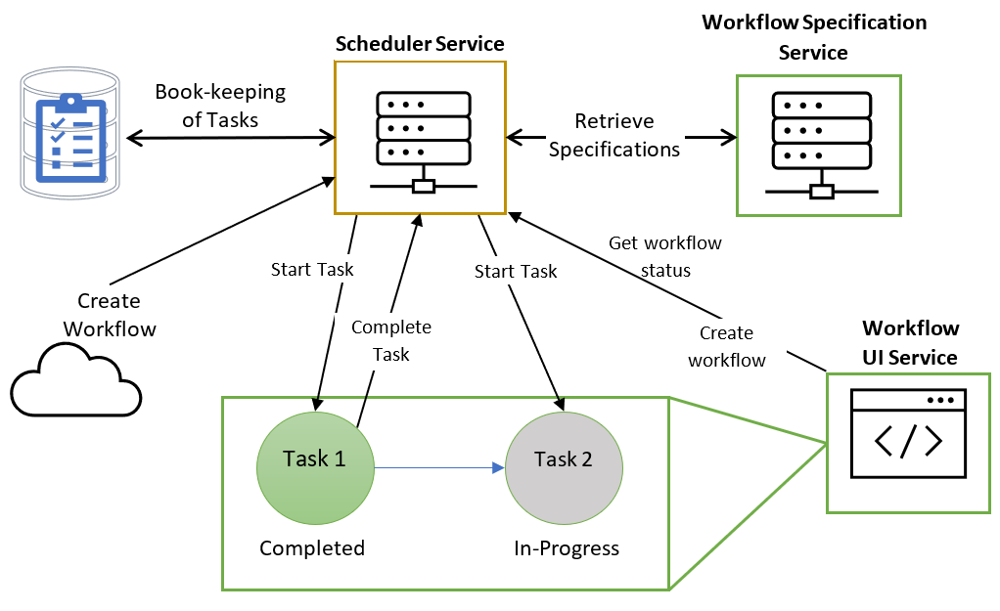

# workflow-as-a-service

SCU COEN 241 (Cloud computing group project)
This repo is replicated from our group's previous repo: https://github.com/ccfernandes/workflow-as-a-service

This is a Platform-as-a-Service application that helps users create (and reuse) workflows using a User interface.
Each activity of a workflow can be defined by its docker image that will be deployed by this framework in a kubernetes cluster.

Workflow Specification Architecture

Workflow Instance Architecture

